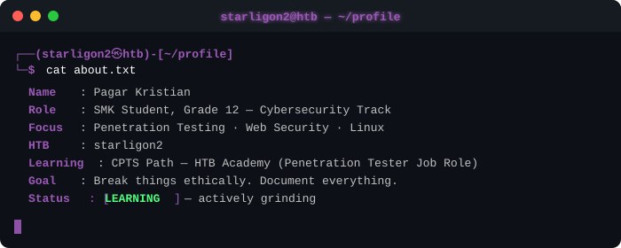
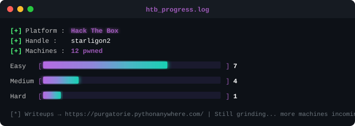

<!-- HEADER TYPING ANIMATION -->

 

<!-- PROFILE VIEWS -->

  

  

<!-- PULSE DIVIDER -->

  

  

<!-- TERMINAL ABOUT SVG -->

  

  

<!-- PULSE DIVIDER -->

  

  

<!-- SKILLS HEADER SVG -->

  

  

### 🛡️ Security & OS

  
  
  
  
  
  

 

### 🐍 Programming

  
  
  

 

### 🔧 Tools & Infra

  
  
  
  

  

<!-- PULSE DIVIDER -->

  

  

<!-- HTB PROGRESS SVG -->

  

  

<!-- PULSE DIVIDER -->

  

  

<!-- CPTS LEARNING SVG -->

  

  

<!-- PULSE DIVIDER -->

  

  

<!-- STATS HEADER SVG -->

  

  

  
  

 

  

  

<!-- SIGMA MAN GIF -->

  

  

<!-- PULSE DIVIDER -->

  

  

<!-- CONNECT HEADER SVG -->

  

  

  
  
  

  

<!-- PULSE DIVIDER -->

  

  

<!-- STARLIGON SIGNATURE BANNER -->

  

